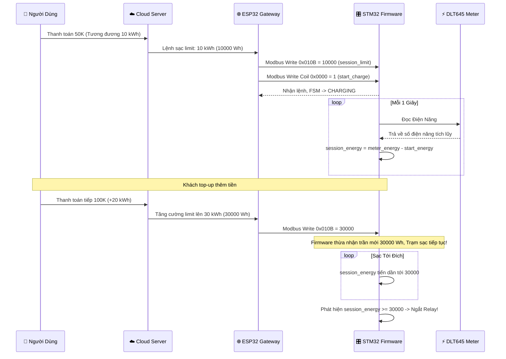

# Firmware Reference Manual (STM32G030)

## 1. System Architecture
**Tên dự án:** Minhnt Charger Simulator/Firmware
**Vi điều khiển chính:** STM32G030C8T6 (Core Cortex-M0+, thay thế cho nền tảng F103 cũ).
**Mô hình cấp phát:** Vòng lặp chính Không đồng bộ (Asynchronous Superloop FSM) kết hợp với Cơ chế ngắt cứng (Hardware Interrupts) cho các kết nối serial. Giảm triệt để Memory footprint và loại bỏ hoàn toàn blocking loop.

### Khai báo chân (Hardware Pinout)
- **COM1 (Modbus RTU Slave):** Giao tiếp với EPS32 Gateway ở 9600-8-N-1. Dùng USART1 (TX: `PA9`, RX: `PA10`, DE: `PA1`).
- **COM2 (DLT645 Electric Meter):** Quét Dữ liệu công tơ điện ở 2400-8-E-1. Dùng USART2 (TX: `PA2`, RX: `PA3`, DE: `PA4`).
- **Relays:** Cấp nguồn Trạm sạc (`PB0`), Cấp nguồn Ổ cắm phụ (`PB1`), Quạt tản nhiệt (`PB10`), Khóa cửa tủ (`PB11`).
- **Inputs & Sensors:** NTC Temperature (ADC1 - `PA0`), Cảm biến cửa (`PB12`), DIP Switch (`PB5, PB6, PB7`).
- **LED Indicators:** Red (`PA8`), Green (`PA11`), White (`PA12`).

---

## 2. Business Logic & State Machine (Nghiệp vụ cốt lõi)

Hệ thống hoạt động xoay quanh Máy trạng thái (FSM) gồm các trạng thái:
1. `STATE_INIT` / `STATE_IDLE`: Chờ (Trắng sáng). Trạm sạc thiết lập chế độ an toàn ban đầu.
2. `STATE_STANDBY`: Chờ kết nối cấp phép (Xanh nhấp nháy). Nếu trạm có tính năng khóa tủ hoặc quét thẻ.
3. `STATE_CHARGING`: Đang sạc (Đỏ nhấp nháy). Trong trạng thái này, chức năng tuần tự logic kiểm tra các bất thường dựa trên Dòng/Áp/Nhiệt theo thời gian thực (Microsecond).
4. `STATE_FINISH`: Kết thúc sạc (Xanh sáng). Xả an toàn cuộn hút sạc.
5. `STATE_ERROR`: Ngắt khẩn cấp, cô lập điện (Đỏ sáng). Đi kèm Cờ Báo Lỗi để Gateway nhận diện.

### Thuật toán cảnh báo và An Toàn Động (Dynamic Auto-Protection)
- **An toàn nhiệt (Overtemp):** Ngắt ngay lập tức mọi Relay nếu ADC NTC vượt mức trần. Tín hiệu LED báo lỗi. Cờ `ALARM_FLAG_OVERTEMP` bật.
- **An toàn Cơ học (Tamper & Door Open):** Nếu phát hiện trạng thái cửa tủ không an toàn hoặc bị tháo gỡ phần cứng (Tamper), ngay lập tức rơi vào ngắt vĩnh viễn (`STATE_ERROR`) chờ xoá lỗi thủ công.
- **Mất kết nối Heartbeat / Meter Comm Fail:** 
  - Timeout DLT645: Không nhận được byte liên tiếp sau 30s (`ALARM_FLAG_COMM_FAIL`).
  - Timeout Master (ESP32): Nếu Master không phản hồi gói ping sau 10s -> ` master_alive = 2` -> Sập Relay.

### Thuật toán năng lượng (Meter Algorithm & Billing)
- **Cấp Số Điện Giới Hạn (Session Energy Limit / Billing):** ESP32 Ghi số Điện năng Mua trước bằng VND quy ra Wh vào thanh ghi `0x010B` (Giới hạn tối đa 65535 Wh tương đương 65.5 kWh). Khi số điện tiêu thụ đạt mức này, MCU tự ngắt Relay (Last Stop Reason `ENERGY_EXCEEDED`). Gateway **hoàn toàn có thể ghi đè (nạp thêm)** vào thanh ghi này trong lúc đang sạc bình thường nêú User top-up tiền!
- **Cân Bằng Tải Động (Dynamic Load Balancing - Overcurrent):** Ngắt sạc nêú Công Tơ báo cáo dòng thực vượt mức `Dynamic_Limit_Ampe` + 10%.
- **Overpower / Overload:** Cắt tự động 100% nếu Trạm dùng quá MAX định mức (ví dụ max trần là 7kW). Hoặc nếu duy trì tải > 110% trong vòng 30 giây (Overload mềm).
- **Ngắt Tự Động Đầu Sạc (Low Current Autocut):** Pin ô tô điện tiêu thụ rất thấp nêú trên 95% pin. Nếu tải rớt dưới `0.5A` liên tiếp 60 giây, Firmware kích hoạt cờ tự chuyển mượt mà về `STATE_FINISH` (Dừng sạc báo xe đầy).

**Luồng chạy chức năng Nạp thêm số dư (Mid-session Topup):**

---

## 3. Kiến trúc Asynchronous Polling (DLT645 Smart Meter)
Đồng hồ chuẩn điện lực DLT645-2007 có Baudrate giới hạn (2400bps) nên thời gian lấy một khung tín hiệu mất cực nhiều thì giờ so với vi xử lý (50-100 miligiây/tin).
Giải quyết triệt để lỗi thắt cổ chai Modbus cũ ở STM bằng:
- **TX Interrupt (Truyền ngắt cực nhanh):** DLT buffer dồn vào cờ TXE. Bật chân tín hiệu Driver Enable (DE pin PA4) thẳng từ Hardware không delay. CPU rảnh rang xử lý mọi tác vụ logic của sạc.
- **Vòng quét Trạng Thái FSM:** Vòng xoay Round Robin độc lập: `Gửi Điện Áp (V)` -> Chờ Timeout 50ms cắt khung -> `Gửi Dòng (I)` -> Cắt khung -> `Gửi Điện Năng (Wh)` -> Cắt Khung. Tổng hòa lại tốn ~1 Giây và làm tươi dữ liệu trên Modbus Holding Register tự động nhẹ nhàng.

---

## 4. Bảng Đăng Ký Thanh Ghi Modbus (Register Map)

Giao tiếp Modbus gốc: `9600-8-N-1` với ESP32 Gateway. Mặc định Slave ID = 1.

### FC04: Input Registers (Read-Only) - Telemetry Trạm Sạc
| Addr   | Tên Tham số         | Đơn vị  | Mô tả |
|--------|---------------------|---------|-------|
| 0x0000 | voltage             | 0.1V    | Điện áp (220.0V = 2200). Đọc từ DLT645. |
| 0x0001 | current             | 0.01A   | Dòng điện (16.50A = 1650). Đọc từ DLT645. |
| 0x0002 | power               | W       | Công suất (Watt). |
| 0x0003 | energy_hi           | Wh      | Năng lượng DLT645 Cấp trên. |
| 0x0004 | energy_lo           | Wh      | Năng lượng DLT645 Cấp dưới. |
| 0x0005 | temperature         | 0.1C    | Nhiệt độ NTC bên trong hệ thống. |
| 0x0006 | fsm_state           | enum    | 0-5. Đọc mục Máy trạng thái. |
| 0x0007 | relay_status        | bitmask | Trạng thái từng chân Relay (Charger, Socket, Door). |
| 0x0009 | meter_alarm         | enum    | Cờ báo cảnh báo DLT645 (Quá tải, Dòng thấp v.v) |
| 0x000C | session_energy      | Wh      | Năng lượng chạy riêng đếm cho 1 vòng sạc. |
| 0x0018 | alarm_flags         | bitmask | bit0=Overtemp, bit1=Door, bit2=Tamper, bit7=Comm Fail, bit10=Overcurrent. |
| 0x002A | last_stop_reason    | enum    | Lý do ngừng (Gateway Request, hay Xe Tự Đầy, hay Auto Cắt). |
| 0x002C | ground_fault        | bool    | 1 = Lỗi Rò rỉ nối đất (Nếu nối mạch dòng dò phần cứng) |

### FC05: Coils (Write-Only) - Tác Nhận Hành Động (Ghi 0xFF00)
| Addr   | Tên Lệnh            | Hành Động |
|--------|---------------------|-----------|
| 0x0000 | start_charge        | Khởi động hệ thống sạc (đóng RL). |
| 0x0001 | stop_charge         | Cắt điện phiên sạc do lệnh thủ công trên server. |
| 0x0002 | unlock_door         | Nhả cờ mở chốt điện 5 giây. |
| 0x0003 | clear_error         | Dọn dẹp lỗi đang kẹt, đưa trạng thái về khởi điểm chờ mới. |
| 0x0006 | enter_fw_update     | Reboot mạch, truy cập cấu hình flash STM32 Bootloader. |

### FC03/06/16: Holding Registers - Biến Cấu Hình Trạm
| Addr   | Tên Cấu Hình        | Mặc Định| Mô tả chức năng Cấu Hình |
|--------|---------------------|---------|--------------------------|
| 0x0100 | fan_high_temp       | 450     | Nhiệt thả relay Quạt thông gió (45.0C). |
| 0x0102 | max_power           | 7000    | Hard-cutoff tức thì (Watt). |
| 0x0103 | rated_power         | 3500    | Nền chuẩn cho cảnh báo Load Balance. |
| 0x0109 | master_heartbeat    | 0       | Tim nhịp theo chu kỳ của Gateway. Ngữ cảnh "Mất ESP32 -> Dừng Sạc Nhằm Bảo Vệ Khách Hàng". |
| 0x010A | current_limit       | 3200    | Gateway cài đặt Dòng chạy Max (Dynamic Balancing Control) cho trạm lẻ. |
| 0x010B | session_energy_lim  | 0       | Dừng sạc khi nạp đủ lượng Wh tiền nạp ví. |
